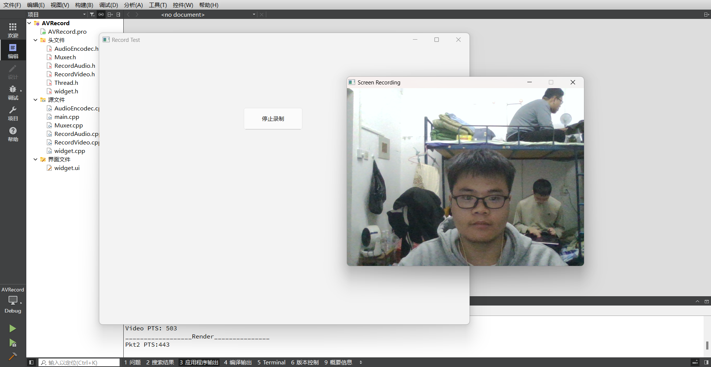

# SimpleRecord-Tool

一款简洁实用的录制工具，可支持对摄像头、麦克风、屏幕及系统声音进行录制，具备采集图像同步显示功能，且能实现停止与继续录制操作。

功能：

- [x] 采集摄像头数据
- [x] 采集麦克风数据
- [x] 屏幕录制
- [x] 系统声音录制
- [x] 实时显示录制画面
- [x] 停止继续录制
- [ ] 自动识别采集设备
- [ ] 提供多种封装格式，目前只支持封装为flv文件

### 实现过程

使用FFmpeg AIP进行数据采集，SDL API实时渲染画面，使用面相对象的实现封装每一个类。

采用多线程架构，包含主线程、录制线程、音频编码线程和封装线程。 

- 主线程：作为控制中心，负责创建多个 Record 录制子线程，分别用于采集视频和音频数据。 

- 录制线程：承担音视频原始数据采集与重采样任务，调用 SDL API 实现视频渲染以同步显示图像，同时视频采集与编码压缩同步进行，避免占用大量内存。还按视频帧率和音频采样频率设置 pts、dts，便于音视频同步。 

- 音频编码线程：专注于音频编码压缩，将 PCM 原始数据封装成 AAC 数据。 

- 封装线程：负责将 AAC 音频数据和 H264 视频数据封装为 FLV 格式。 

  

  亮点：`多线程实现，提高效率`。`同步显示采集图像方便调整和监控`。`音视频同步效果好`。

### 效果展示

